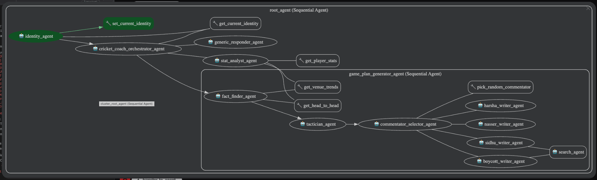
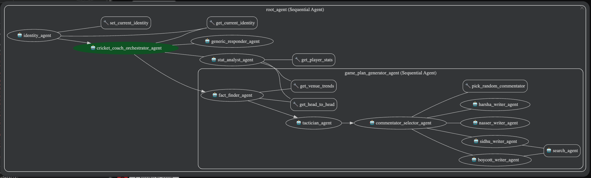
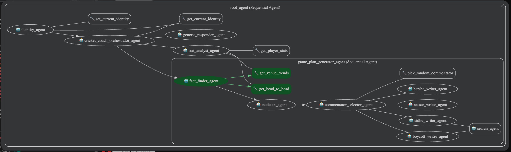
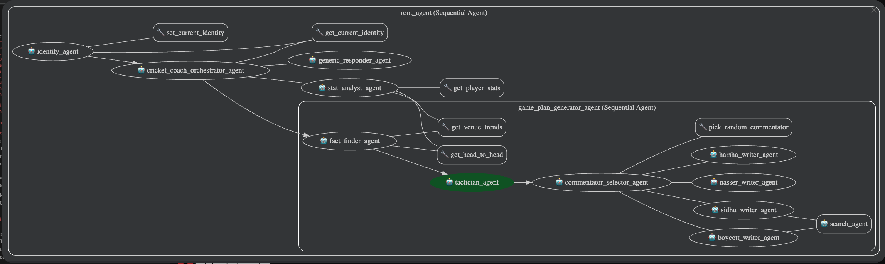
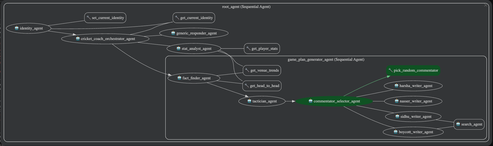
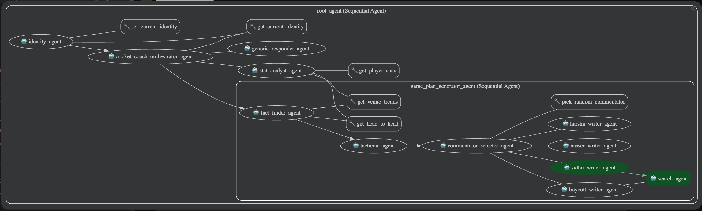
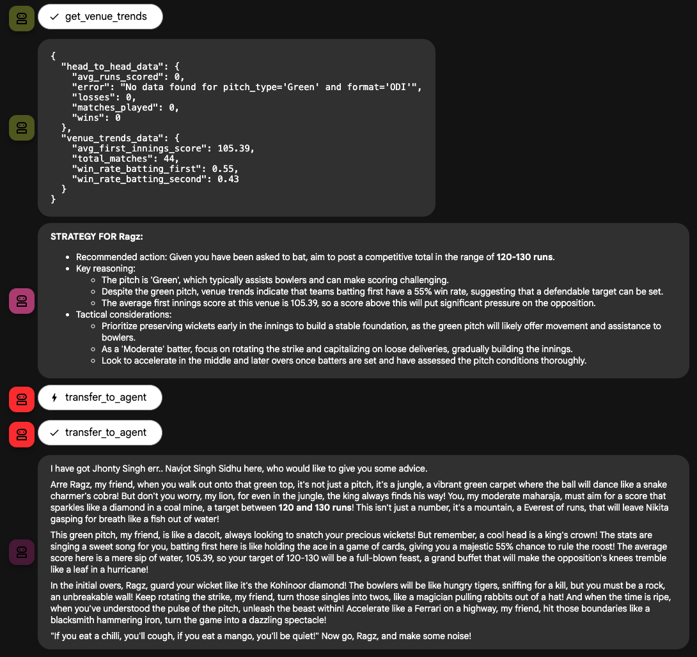

# VR Cricket Strategist: AI-Powered Match Intelligence 🏏

> **Hackathon Project**: Democratizing VR Cricket strategy through multi-agent AI systems built with Google's Agent Development Kit (ADK)



---

## 📋 Table of Contents
- [Problem Statement](#-problem-statement)
- [Solution](#-solution)
- [Architecture](#-architecture)
- [Features](#-features)
- [Setup Instructions](#-setup-instructions)
- [Usage](#-usage)
- [Technical Details](#-technical-details)
- [Testing](#-testing)
- [Demo & Examples](#-demo--examples)
- [Future Enhancements](#-future-enhancements)

---

## 🎯 Problem Statement

**VR Cricket** is a competitive gaming phenomenon where players participate in virtual tournaments. Unlike real cricket, VR Cricket has unique constraints: players only control batting and high-level decisions—the game engine handles bowling and fielding automatically.

Players constantly face critical decisions:
- Should I bat first or chase?
- What's a safe target on this pitch type?
- When should I declare in a Test match?
- What are my chances of chasing this target?

**The Challenge**: Professional esports teams employ data analysts with sophisticated tools and databases. Casual tournament players lack this intelligence. They make crucial decisions affecting tournament advancement based purely on gut feeling and limited memory of recent matches.

**The Gap**: How do we democratize VR Cricket strategy, bringing esports-level analysis to casual players with instant, personalized, data-driven decision-making?

---

## 💡 Solution

**VR Cricket Strategist** is a production-ready multi-agent system built with Google's ADK and Gemini 2.5 Flash. It delivers personalized, data-driven tournament strategy through specialized AI agents, helping players decide: bat first or chase, when to declare, and safe target scores based on historical performance.

### Why Agents?

**Task Decomposition**: Strategy requires gathering historical data, analyzing pitch conditions, calculating probabilities, formulating tactics, and delivering engaging insights. A multi-agent system creates focused experts for each task.

**Dynamic Routing**: Queries vary wildly—from "What's my T20 batting average?" to "Should I bat first on green pitch?" A root orchestrator intelligently routes requests to appropriate specialists.

**Sequential Workflows**: Analysis follows a natural pipeline: gather history → analyze patterns → formulate advice → deliver engagingly. Sequential agents model this perfectly.

**Personality & Engagement**: Gaming is entertainment, not just data. Multiple commentator agents deliver strategic insights with personality, making VR Cricket engaging rather than robotic.

**Reliability & Observability**: Callbacks and circuit breakers monitor agent behavior, prevent routing loops, and ensure reliability—critical for time-sensitive tournament decisions.

---

## 🏗️ Architecture


### System Components

**1. Root Orchestrator (Sequential Agent)**
- Identifies users via session state
- Routes queries to specialized agents
- Maintains conversation context

**2. GamePlanGenerator (Sequential Agent)**
Three-agent workflow:
- **FactFinder**: Retrieves historical data using custom tools
- **Tactician**: Formulates strategy using tournament-specific logic
- **CommentatorRouter**: Selects personality for delivery

**3. StatAnalyst (Agent)**
- Handles data queries about player statistics
- Direct tool access for historical records
- Quick statistical lookups

**4. Commentator Agents (4 Personalities)**
- **BoycottWriter**: Analytical/critical (Geoffrey Boycott style)
- **SidhuWriter**: Entertaining/metaphors (Navjot Sidhu style)
- **NasserWriter**: Tactical/modern (Nasser Hussain style)
- **HarshaWriter**: Eloquent/storytelling (Harsha Bhogle style)

**5. GenericResponder (Fallback)**
- Handles general queries outside cricket strategy
- Ensures graceful degradation

### Custom Tools (5)

1. **`get_venue_trends`**: Calculates average scores and win rates by pitch type and venue
2. **`get_head_to_head`**: Retrieves matchup records and performance stats
3. **`get_player_stats`**: Computes comprehensive player statistics (matches, runs, averages, strike rates, centuries, etc.)
4. **`get_current_identity`**: Accesses session state for user identification with dev mode auto-injection
5. **`pick_random_commentator`**: Randomly selects commentator personalities

### Observability: Circuit Breaker Callback

A custom `before_agent_callback` monitors agent transfers. If an agent receives identical input 5+ times (ping-pong loop), the circuit breaker injects override instructions to stop gracefully, preventing infinite loops.

---

## ✨ Features

- ✅ **Data-driven analysis** using CSV match history (100+ matches)
- ✅ **Multi-format support**: Test, ODI, and T20 strategies
- ✅ **Personalized advice** based on user's historical performance
- ✅ **Pitch-aware tactics**: Green, flat, dusty pitches with weather conditions
- ✅ **Session management**: Maintains user context across conversations
- ✅ **Personality-driven responses**: 4 distinct commentator styles
- ✅ **Circuit breaker protection**: Prevents infinite agent loops
- ✅ **Comprehensive test suite**: Unit test coverage with pytest, evaluations using `adk eval`
- ✅ **Web UI**: Interactive testing interface

---

## 🚀 Setup Instructions

### Prerequisites
- Python 3.11 or higher
- Google Cloud account with Vertex AI access
- Google API key or service account credentials

### Step 1: Clone Repository
```bash
git clone https://github.com/paragnairdev/google-adk-learning.git
cd google-adk-learning
```

### Step 2: Create Virtual Environment
```bash
python3 -m venv venv
source venv/bin/activate  # On Windows: venv\Scripts\activate
```

### Step 3: Install Dependencies
```bash
pip install -r requirements.txt
```

### Step 4: Set Up Google Cloud Credentials

**Option A: Using API Key (Recommended for testing)**
```bash
export GOOGLE_API_KEY="your-api-key-here"
```

**Option B: Using Service Account**
```bash
export GOOGLE_APPLICATION_CREDENTIALS="path/to/your/credentials.json"
```

**Option C: Using gcloud CLI**
```bash
gcloud auth application-default login
```

### Step 5: Verify Setup
```bash
# List available models
python list_models.py

# Run tests to verify installation
pytest agents/vr_cricket_strategist/tests/
```

---

## 📖 Usage

### Launch Web UI (Interactive Mode)
```bash
./launch_web_ui.sh
# Or: python launch_web_ui.py
```
Then open http://localhost:8000

The web UI provides:
- Interactive chat interface
- Visual agent workflow diagram
- Request/response history
- Session management

---

## 🔧 Technical Details

### Stack
- **Google ADK**: Agent orchestration, sessions, tool integration
- **Gemini 2.5 Flash**: LLM with retry logic
- **Python 3.13**: Core language
- **Pandas**: Data processing and analysis
- **SQLite**: Session state management
- **pytest**: Testing framework

### Data Pipeline
- **matches.csv**: 1000+ match records (Test/ODI/T20)
- **players.csv**: Player profiles
- Custom pandas-based tools for efficient querying

### Session Management
ADK's session service maintains:
- Player identity across conversations
- Request history for context
- Retry counts for circuit breaker
- Last inputs for loop detection

### Key Challenges Solved
- **Agent Loop Prevention**: Circuit breaker detects and stops infinite routing
- **Session State Management**: Maintaining user identity across conversation turns
- **Tool Parameter Inference**: Extracting parameters (format, pitch, opponent) from natural language
- **Personality Consistency**: Each commentator maintains distinct voice through crafted instructions
- **Context-Aware Strategy**: Understanding VR Cricket constraints (batting-only decisions)

---

## 🧪 Testing

### Run All Tests
```bash
pytest agents/vr_cricket_strategist/tests/
```

### Run Specific Test Modules
```bash
# Test tools
pytest agents/vr_cricket_strategist/tests/test_tools.py

# Test agent configuration
pytest agents/vr_cricket_strategist/tests/test_config.py

# Test data loader
pytest agents/vr_cricket_strategist/tests/test_data_loader.py

# Test agent behavior
pytest agents/vr_cricket_strategist/tests/test_agent.py
```

### Generate Coverage Report
```bash
pytest --cov=agents.vr_cricket_strategist --cov-report=html
open htmlcov/index.html
```

### Run evaluations (Integration Tests)
```bash
bash run_evaluations.sh
```

### Test Coverage
**100+ comprehensive tests** covering:
- Tool functionality and edge cases
- Agent configuration validation
- Data integrity and loading
- Integration workflows
- Session management
- Circuit breaker logic
- Evaluations

---

## 🎬 Demo & Examples

### Example Query 1: Strategic Decision

**User Query**: 
> "I'm playing against Ragz in a T20 VR Cricket tournament on a green pitch with overcast conditions. Should I bat first or chase?"

**System Flow**:
1. Root agent calls `get_current_identity()` → identifies user as "Joe" from England
2. Routes to GamePlanGenerator (sequential workflow begins)
3. FactFinder calls `get_head_to_head("Joe", "Ragz", "T20")` and `get_venue_trends("T20", "Green")`
4. Tactician analyzes: Green pitch shows 58% win rate for teams batting second
5. CommentatorRouter calls `pick_random_commentator()` → selects "Nasser"
6. NasserWriter delivers tactical advice

**Response**:
> "Right then, Joe. Looking at your tournament history, I'd strongly recommend bowling first here. Green pitches in VR Cricket show teams chasing win 58% of the time, and you've historically struggled setting targets against Ragz—you've only defended successfully once in your last 5 encounters. The average first innings score is 165, so if you chase, aim for calculated aggression. Set a target of 15-20 runs above average in your powerplay, and you should be on track..."

### Example Query 2: Declaration Decision

**User Query**: 
> "I'm at 450/5 in a Test match after 100 overs. Should I declare or keep batting?"

**Response** (Geoffrey Boycott style):
> "Geoffrey Boycott here. Look, you're in a commanding position at 450 for 5. On this pitch type, teams batting second average 380 in Test matches. I'd bat on for another 10-15 overs—get yourself to 500-520. That extra cushion is worth more than the time cost. Remember, in VR Cricket tournaments, declarations can't be reversed. Better to be 70 runs safer than 5 overs shorter. Patience wins Test matches, lad."

### Example Query 3: Statistical Lookup

**User Query**: 
> "What's my T20 batting average?"

**Response** (via StatAnalyst):
> "Based on your tournament history, you've played 45 T20 matches with an average of 32.5 runs per innings and a strike rate of 142.3. You've scored 3 centuries and 8 half-centuries. Your best performance was 87* against Kumar on a flat pitch."

### Interactive Demo Screenshots

View complete interaction flows in `examples/interactions`:

User prompt
> "I have a ODI against Nikita on a Green pitch and I have been asked to bat. What sort of score should I be looking to post?"

#### Step 1: Identity Agent

Identifies the current player (Joe)


#### Step 2: Orchestrator Agent

Decides this needs the game planner as the request is for strategy


#### Step 3: Fact Finder

Gets venue details and head-to-head statistics on Green pitches for Joe and Nikita


#### Step 4: Tactician

Analyzes the matchup data and generates a strategy for Joe


#### Step 5: Personality Selector

Decides who should be delivering the strategy in their own unique style. Decides it should be Sidhu



#### Step 6: Quote Finder

Uses google search to look for whacky quotes from Navjot Singh Sidhu to add some humour into the delivery


#### The Result

The agent delivers the strategy in an entertaining manner


---

## 🔮 Future Enhancements

### Planned Features

**ML Win Probability**: Implement machine learning models predicting chase success and optimal declaration timing based on historical patterns.

**Live Tournament Integration**: Connect to VR Cricket APIs for real-time in-game strategy and dynamic analysis during matches.

**Voice Interface**: Add speech-to-text/text-to-speech for verbal queries—perfect for streaming and hands-free operation.

**Discord Bot**: Deploy for tournament communities with integrated queries, statistics, and leaderboards.

**Real Tournament Data**: Auto-import from VR Cricket platforms, expanding beyond synthetic datasets.

**Agent Simulations**: Simulate matches based on historical data, predicting bracket outcomes and tournament progressions.

**Mobile App**: Native iOS/Android apps for on-the-go tournament strategy.

**Multiplayer Team Strategy**: Collaborative strategy sessions for team tournaments with shared insights.

---

## 📚 Resources

- [Google ADK Documentation](https://cloud.google.com/vertex-ai/docs/agent-development-kit)
- [Google ADK GitHub](https://github.com/google/adk)
- [Gemini API](https://ai.google.dev/)
- [Project Writeup](resources/capstone-project-writeup.md)

---

## 📝 Project Structure

```
google-adk/
├── agents/
│   └── vr_cricket_strategist/
│       ├── agent.py              # Main agent orchestration
│       ├── config.py             # Agent configurations
│       ├── tools.py              # Custom tool implementations
│       ├── data_loader.py        # Data loading utilities
│       ├── callbacks.py          # Circuit breaker implementation
│       ├── sub_agents/
│       │   ├── orchestrators.py  # Root and orchestrator agents
│       │   ├── strategy.py       # Strategy generation agents
│       │   ├── data_collectors.py # Data collection agents
│       │   └── commentators.py   # Personality commentator agents
│       └── tests/
│           ├── test_agent.py
│           ├── test_config.py
│           ├── test_data_loader.py
│           └── test_tools.py
├── vr_cricket_dataset/
│   ├── matches.csv              # Match history data
│   └── players.csv              # Player profiles
├── examples/
│   └── interactions/            # Demo screenshots
├── launch_web_ui.py             # Web UI launcher
├── requirements.txt             # Python dependencies
└── README.md                    # This file
```

---

## 📄 License

MIT License - see LICENSE file for details

---

## 👨‍💻 Author

**[Parag Nair](https://github.com/paragnairdev)**
- Built for Google ADK Hackathon
- Powered by: Google Agent Development Kit, Gemini 2.5 Flash, Python 3.13

---

**Built with ❤️ using Google ADK**
